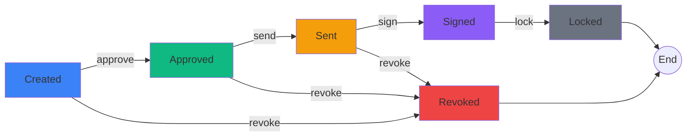

# ContractFlow 📄✨

**Simple Contract Management, Designed for Clarity.**

ContractFlow is a modern, Next.js-based SaaS application designed to streamline the entire lifecycle of legal documents. From creating reusable "Blueprints" to tracking agreements through a visual timeline, ContractFlow makes contract management intuitive, beautiful, and efficient.

### 🌐 **Live Demo:** [**https://contract-flow-omega.vercel.app/**](https://contract-flow-omega.vercel.app/)


## 📸 Screenshots

### Home Page


### Contract Page


### Blueprint Page


### New Blueprint Creation


### New Contract Creation


---


## 🚀 Features

* **📝 Smart Blueprints:** Define reusable templates once with dynamic fields (**Text**, **Date**, **Checkbox**, **Signature**) for rapid, error-free drafting.
* **⏳ Visual Lifecycle:** Track document progress (`Created` → `Locked`) via a vibrant glassmorphic timeline, powered by a strict State Machine to prevent invalid transitions.
* **🎨 Paper-Like UX:** A distraction-free, realistic **A4 workspace** with context-aware inputs that automatically lock upon finalization.
* **📊 Command Dashboard:** A filterable "Glassmorphism" hub to track activity (Active, Signed, Revoked) and manage your pipeline in real-time.
* **💾 Zero-Config Persistence:** Built on **LocalStorage** with auto-seeded demo data for instant, no-setup evaluation.
---

## 📦 Getting Started

Follow these steps to run ContractFlow locally:

1.  **Clone the repository**
    ```bash
    git clone [https://github.com/your-username/contract-flow.git](https://github.com/your-username/contract-flow.git)
    cd contract-flow
    ```

2.  **Install dependencies**
    ```bash
    npm install
    # or
    yarn install
    ```

3.  **Run the development server**
    ```bash
    npm run dev
    ```

4.  **Open your browser**
    Navigate to `http://localhost:3000` to see the app in action.

---
## 🛠️ Technology Stack

<table>
<tr>
<td><strong>Category</strong></td>
<td><strong>Technology</strong></td>
<td><strong>Justification</strong></td>
</tr>
<tr>
<td>Framework</td>
<td>Next.js 14 (App Router)</td>
<td>Modern layouts, built-in optimizations, production-ready</td>
</tr>
<tr>
<td>Language</td>
<td>TypeScript 5.0+</td>
<td>Union types for <code>ContractStatus</code> prevent runtime errors</td>
</tr>
<tr>
<td>Styling</td>
<td>Tailwind CSS</td>
<td>Consistent design tokens, responsive utilities, minimal CSS</td>
</tr>
<tr>
<td>Icons</td>
<td>Lucide React</td>
<td>Lightweight, tree-shakeable, professional SVGs</td>
</tr>
<tr>
<td>State</td>
<td>Context API + Reducer</td>
<td>Zero dependencies, predictable state updates</td>
</tr>
</table>

---

## 📂 Project Structure

```text
src
├── app
│   ├── blueprints              # Blueprint management pages
│   ├── context
│   │   └── ContractContext.tsx # Global State & Storage logic
│   ├── contracts
│   │   └── [id]                # Individual contract workspace logic
│   ├── favicon.ico
│   ├── globals.css             # Global styles & Tailwind directives
│   ├── layout.tsx              # Root application layout
│   └── page.tsx                # Dashboard (Home page)
├── components
│   ├── dashboard               # Dashboard-specific components
│   │   ├── BlueprintGrid.tsx
│   │   ├── CreateContractModal.tsx
│   │   └── RecentActivity.tsx
│   ├── Button.tsx              # Reusable Button component
│   ├── HeroSection.tsx         # Landing page hero with animations
│   ├── Input.tsx               # Reusable Form Input
│   └── NavBar.tsx              # Global Navigation Bar
└── lib
    └── demo-data.ts            # Mock data and utility functions
```


## 📖 Usage Guide

### 1. 📝 Creating a Blueprint (The Template)
1.  Navigate to the **Blueprints** page by clicking the `+ Create Blueprint` button on the Dashboard.
2.  Enter a descriptive name (e.g., *"Standard NDA"*).
3.  Add dynamic fields to structure your document:
    * **Text Field:** For names, addresses, or custom clauses.
    * **Date Field:** For effective dates or deadlines.
    * **Checkbox:** For toggleable options (e.g., *"Perpetual License?"*).
    * **Signature:** A dedicated block for digital signing.
4.  Click `Save Blueprint` to store it in your library.

### 2. ⚡ Drafting a Contract
1.  On the **Dashboard**, scroll to the **Start from Template** grid.
2.  Click on any Blueprint card to open the creation modal.
3.  Enter a unique **Contract Name** (e.g., *"NDA - Acme Corp"*).
4.  Click `Create & Open` to enter the workspace.

### 3. 🖥️ The Document Workspace
* **Fill Details:** Type directly into the interactive "Paper" UI.
* **Lifecycle Control:** Use the top bar to progress the contract status:
    * `Approve`: Validates the draft.
    * `Send`: Marks the contract as sent to the client.
    * `Sign`: Simulates a digital signature and adds the **"Verified"** badge.
    * `Lock`: Finalizes the document. **⚠️ Inputs become read-only.**
* **Revoke:** If a deal falls through, click the `Revoke` button to stamp the document as **VOID**.

### 4. 🔍 Dashboard Filtering
Use the filter tabs on the **Recent Activity** table to organize your view:
* `All`: View every document in the system.
* `Active`: Contracts currently in progress (`Created`, `Approved`, `Sent`).
* `Signed`: Finalized agreements (`Signed`, `Locked`).
* `Revoked`: Cancelled or voided contracts.

### Workflow



**Implementation**:
```typescript
const STATE_TRANSITIONS: Record<ContractStatus, ContractStatus[]> = {
  CREATED: ['APPROVED', 'REVOKED'],
  APPROVED: ['SENT', 'REVOKED'],
  SENT: ['SIGNED', 'REVOKED'],
  SIGNED: ['LOCKED'],
  LOCKED: [],
  REVOKED: []
};
```

**Guarantees**:
- A contract **cannot** be signed before being sent
- A contract **cannot** be edited once locked
- Invalid transitions throw compile-time errors

---


## 🔍 Assumptions & Trade-offs

### Current Limitations

| Area | Current State | Production Requirement |
|------|---------------|------------------------|
| **Persistence** | `localStorage` (Browser-based) | Cloud Database (PostgreSQL/Supabase) |
| **Auth** | None (Single User Mode) | Secure Auth (Clerk / NextAuth) |
| **Signatures** | Status Toggle / Mock Text | Canvas API or DocuSign Integration |
| **Validation** | Basic Conditional Logic | Zod/Yup Schema Validation |
| **Filtering** | Client-side Array Methods | Server-side Querying & Indexing |

### Architectural Decisions

✅ **Chosen: React Context API over Redux**
- **Reason:** Lightweight, zero-dependency state management suitable for the application's flat data structure.
- **Trade-off:** Potential re-render performance issues at massive scale compared to atomic state libraries.

✅ **Chosen: Tailwind CSS over UI Libraries (MUI/Chakra)**
- **Reason:** Essential for achieving the custom "Glassmorphism" and realistic "Paper" effects without fighting default library styles.
- **Trade-off:** Markup becomes verbose with utility classes.
---

## 🧪 Testing & Verification


* **🛠️ Blueprints:** Successfully created templates with mixed fields (Text, Date, Signature) and verified local persistence.
* **🔄 Lifecycle:** Confirmed full flow (`Created` → `Approved` → `Sent` → `Signed` → `Locked`) and input locking on finalization.
* **🛡️ Safety:** Validated that **Revoke** immediately voids the document and that data persists across browser refreshes.
* **📱 UI:** Tested responsive "Paper" layout and glassmorphism rendering across Desktop, Tablet, and Mobile.

---


<div align="center">

## 👨‍💻 Author

**Biswajit Mahanty**

</div>
